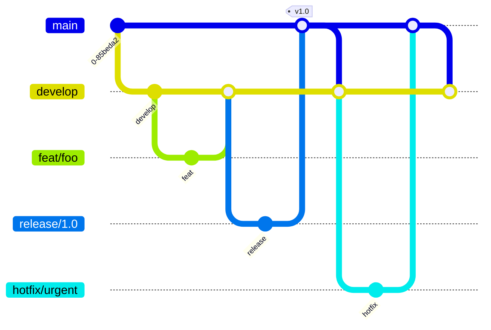

# Lapis

<p align="center">
  
</p>

A modern, cross-platform task management app built with Flutter and Firebase. Lapis combines a clean UI with real-time sync, focus tools, and deep customization — no subscriptions, no ads.

## Features

- **Authentication** — Email/password, Google Sign-In, Apple Sign-In, and GitHub OAuth
- **Dashboard** — Filter by status (Undone / In Progress / Fulfilled), search, Kanban view, smart filters, group/sort options
- **Task Management** — Titles, notes, deadlines, priorities, categories, subtasks, recurring tasks, pinning, archiving
- **Calendar view** — Interactive date grid with colored task dots and per-day task lists
- **Focus Mode** — Built-in Pomodoro timer with Android screen pinning support
- **Statistics** — Completion streaks, bar charts (last 7 days), breakdowns by category/priority, focus session stats
- **Notifications** — Deadline reminders via FCM push notifications and local scheduled alerts
- **Weekly Review** — Automatic Sunday recap dialog with weekly completion count
- **Realtime Sync** — Cloud Firestore with offline persistence
- **Theming** — Light/dark/system mode, customizable accent colors
- **Cross-platform** — Android, iOS, Web, macOS, Windows, Linux

## Tech Stack

| Layer | Technology |
|-------|-----------|
| Frontend | Flutter (Dart 3.x) |
| State | Riverpod |
| Backend | Firebase (Auth, Firestore, Cloud Functions, FCM, App Check, Crashlytics) |
| Storage | Firebase Storage (profile pictures) |
| CI | GitHub Actions (analyze + test) + Codemagic (Android builds) |

## Getting Started

### Prerequisites

- [Flutter SDK](https://flutter.dev/docs/get-started/install) (stable channel, Dart 3.x)
- A Firebase project with Authentication, Firestore, and Storage enabled

### Setup

```bash
# Clone the repo
git clone https://github.com/VictorVictus/Lapis.git
cd Lapis

# Install dependencies
flutter pub get

# Configure Firebase
flutterfire configure --project=todoa-e26b3

# Run on a device or emulator
flutter run
```

> **Note:** Firestore security rules and indexes are tracked in `firestore.rules` and `firestore.indexes.json`. Deploy them with:
> ```bash
> firebase deploy --only firestore:rules,firestore:indexes
> ```

### Cloud Functions

Deadline reminder push notifications run as a scheduled Cloud Function:

```bash
cd functions
npm install
npm run build
firebase deploy --only functions
```

## Project Structure

```
lib/
├── core/              # Bootstrap, shared utilities
├── models/            # Data models (Task, User, FocusSession, etc.)
├── providers/         # Riverpod state providers
├── screens/           # Auth, Dashboard, Schedule, Focus, Stats, Archive
├── services/          # Firebase interop (Auth, Tasks, Notifications, etc.)
├── theme/             # Light & dark theme definitions
└── widgets/           # Reusable UI components
```

## Branch Workflow



| Branch | Purpose | Base | Lifespan |
|--------|---------|------|----------|
| `main` | Released code (Play Store) | — | Permanent, protected |
| `develop` | Integration — features merge here first | `main` | Permanent, protected |
| `feat/*` | New features | `develop` | Deleted after PR |
| `fix/*` | Bug fixes | `develop` | Deleted after PR |
| `release/*` | Pre-release stabilization | `develop` | Deleted after merge + tag |
| `hotfix/*` | Urgent production fix | `main` | Deleted after PR + backport |

### Cheat Sheet

| Step | Command |
|------|---------|
| **Start work** | `git checkout develop && git pull && git checkout -b feat/my-thing` |
| **Push branch** | `git push -u origin feat/my-thing` |
| **Open PR** | GitHub UI → `feat/my-thing` into `develop` |
| **Merge PR** | GitHub UI (squash merge) |
| **Sync develop** | `git checkout develop && git pull` |
| **Start release** | `git checkout develop && git checkout -b release/1.2.0` |
| **Finish release** | PR `release/1.2.0` → `main` → merge → tag |
| **Tag release** | `git tag v1.2.0 && git push origin v1.2.0` |
| **Hotfix** | `git checkout main && git checkout -b hotfix/urgent` → PR to `main` + PR to `develop` |

### CI Triggers

| Event | Branches | Jobs |
|-------|----------|------|
| Push / PR | `main`, `develop`, `feat/*`, `fix/*`, `release/*` | `analyze`, `test` (GitHub Actions) |
| Push | `main`, `release/*` | `android-release` build (Codemagic) |

### Rulesets (GitHub Settings → Branches → Add rule)

Configured on **both** `main` and `develop`:

| Rule | `main` | `develop` |
|------|--------|-----------|
| Require a pull request before merging | ✅ | ✅ |
| Require status checks (analyze, test) | ✅ | ✅ |
| Require branches to be up-to-date | ✅ | ✅ |
| Do not allow bypassing (admins exempt) | ❌ | ❌ |

> **"Do not allow bypassing" is unchecked** — admins bypass rules when needed; non-admins must follow them.

## Contributing

1. Pick an issue or create one
2. Branch from `develop`: `git checkout -b feat/my-thing`
3. Make changes, commit with conventional messages (`feat:`, `fix:`, `chore:`)
4. Push and open a PR into `develop`
5. Wait for CI (analyze + test) to pass
6. Merge via GitHub UI (squash)

### PR Checklist

- [ ] `flutter analyze lib` passes
- [ ] `flutter test` passes
- [ ] No new unused imports or dead code
- [ ] No secrets, keys, or configs committed

### Commit Convention

```
type(scope): description

feat:     new feature
fix:      bug fix
chore:    refactor, deps, tooling, CI
docs:     documentation
BREAKING: incompatible change

Examples:
  feat(ui): add dark mode toggle
  fix(api): handle null deadline on task create
  chore(deps): remove flutter_colorpicker
```
